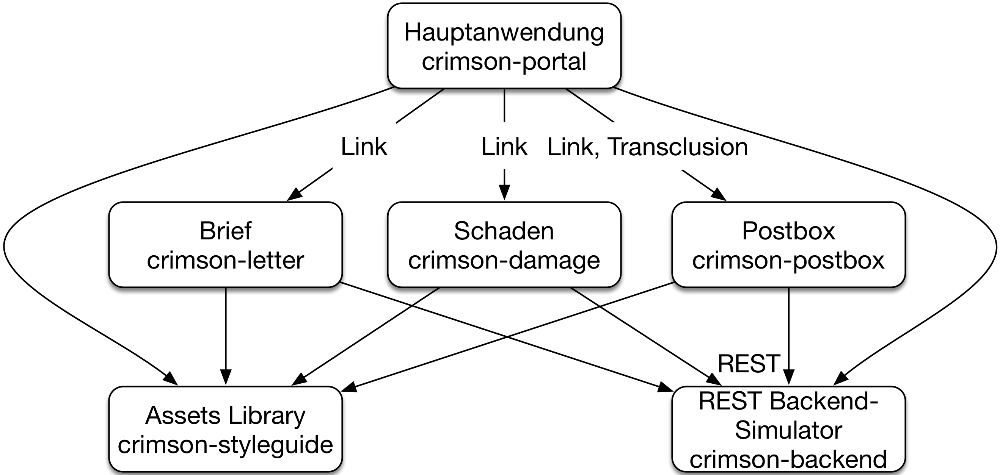

# Konzept: Frontend-Integration

Microservices können ein Web-Frontend enthalten. Self-contained
Systems müssen sogar ein Web-Frontend haben. Daher können Microservices
am Frontend integriert werden.

## Warum Frontend-Integration?

Frontend-Integration erzeugt eine *lose Kopplung*. Wenn Links für die
Integration verwendet werden, muss für eine Integration nur eine URL
bekannt sein. Was sich hinter der URL verbirgt und wie die
Informationen dargestellt werden, kann geändert werden, ohne dass es
das System beeinflusst, das die URL in einem Link anzeigt.

Ein weiterer Vorteil von Frontend-Integration ist die *freie Wahl der
Frontend-Technologien*. Gerade bei Frontend-Technologien gibt es sehr viele
Innovationen. Ständig gibt es neue JavaScript-Frameworks und
neue Möglichkeiten, attraktive Oberflächen zu gestalten. Ein wichtiger
Vorteil von Microservices ist die Technologiefreiheit. Jeder
Microservice kann eigene Technologien wählen. Wenn Technologiefreiheit
auch für das Frontend gelten soll, dann muss jeder Microservice sein
eigenes Frontend mitbringen, das eine eigene Technologie nutzen
kann. Dazu müssen die Frontends geeignet integriert sein.

Dank Frontend-Integration ist für eine Funktionalität *alle Logik in
einem Microservice* implementiert. Beispielsweise kann ein Microservice
dafür verantwortlich sein, eingegangene Nachrichten anzuzeigen, selbst
wenn die Nachrichten in der UI eines anderen Microservice integriert
dargestellt wird. Wenn weitere Informationen, wie beispielsweise eine
Priorität angezeigt werden sollen, kann die Logik, die Datenhaltung
und auch die Darstellung durch Änderung von nur einem Microservice
umgesetzt werden, selbst wenn ein anderer Microservice die Darstellung
nutzt.

## Rezept: ESI (Edge Side Includes)

[ESI](https://www.w3.org/TR/esi-lang) (Edge Side Includes) ermöglichen
es einem Microservice,
HTML-Fragmente anderer Microservices zu integrieren.
Dazu erzeugt der Microservice HTML,
das ESI-Tags enthält. Die ESI-Implementierung wertet die ESI-Tags aus
und bindet dann an den richtigen Stellen HTML-Fragmente anderer
Microservices ein.

ESI wird vor allem von Caches implementiert. Durch die Aufteilung der
HTML-Seiten können statische Fragmente gecacht werden, selbst wenn sie
in einer dynamischen Website integriert sind. CDNs (Content Delivery
Networks) können ebenfalls
ESI implementieren. CDNs dienen eigentlich dazu, statische HTML-Seiten
und Images auszuliefern. Dazu betreiben CDNs Server an
Knotenpunkten im Internet, so dass jeder Nutzer die Seiten und Images
von einem Server in der Nähe laden kann und die Ladezeiten reduziert
werden.
Mit ESI können die CDNs zumindest Fragmente dynamischer Seiten
ebenfalls cachen.

Also setzt ESI eine HTML-Seite aus mehreren HTML-Fragmenten zusammen,
die von verschiedenen Microservices geliefert werden können.

Ein Beispiel für eine ESI-Integration steht unter
<https://github.com/ewolff/SCS-ESI> bereit. Die Anleitung, um das Beispiel
auszuprobieren, findet sich unter
<https://github.com/ewolff/SCS-ESI/blob/master/WIE-LAUFEN.md>.

Im Beispiel dient die ESI-Integration dazu, Fragmente eines
Common-Microservices in alle Microservices zu integrieren. Das
Beispiel enthält nur einen konkret implementierten Microservice,
nämlich den Order-Microservice. Der Order-Microservice ist eine
Spring-Boot-Anwendung und in Java geschrieben, während der
Common-Microservice in Go geschrieben ist. Das zeigt, dass
auch sehr unterschiedlichen Technologien im Frontend integriert werden
können.

{title="Listing 1: Vom Order-Microservice ausgegebenes HTML", id="listing-01"}
~~~~~~~~
<html>
<head>
...
  <esi:include src="/common/header"></esi:include>
</head>

<body>
  

    <esi:include src="/common/navbar"></esi:include>
    ...
  

  <esi:include src="/common/footer"></esi:include>
</body>
</html>
~~~~~~~~

Der Order-Microservice gibt eine HTML-Seite wie in [Listing 1](#listing-01)
aus. Eine solche Seite steht unter
<http://localhost:8090/> zur Verfügung, wenn die Docker-Container auf
dem lokalen Rechner laufen. Wenn man diese Seite im Browser ansieht,
interpretiert der Browser die ESI-Tags nicht, so dass der Browser eine
verstümmelte Web-Seite anzeigt.

Das Beispiel nutzt den Web-Cache [Varnish](https://varnish-cache.org/)
als ESI-Implementierung. Der Common-Microservice ergänzt die
Inhalte für die ESI-Tags. Der Varnish steht unter
<http://localhost:8080/> bereit, wenn die Docker-Container auf dem
lokalen Rechner laufen. [Listing 2](#listing-02) zeigt das HTML, das
der Varnish ausgibt.

{title="Listing 2: Vom Varnish ausgegebenes HTML", id="listing-02"}
~~~~~~~~
<html>
<head>
...
  <link rel="stylesheet"
   href="/common/bootstrap-3.3.7/bootstrap.css" />
  <link rel="stylesheet"
   href="/common/bootstrap-3.3.7/bootstrap-theme.css" />
</head>

<body>
  

    <a class="brand"
     href="https://github.com/ultraq/thymeleaf-layout-dialect">
     Thymeleaf - Layout </a>
    Mon Sep 18 2017 17:52:01 

    ...
  

  <script
   src="/common/bootstrap-3.3.7/bootstrap.js" />
</body>
</html>
~~~~~~~~

Wie man sieht, ergänzt der Common-Microservice Header und Footer sowie
eine Navigationsleiste. Der Common-Microservice implementiert außerdem
eine Art Asset-Server: Er stellt gemeinsam genutzte Bibliotheken wie
Bootstrap zur Verfügung.

Bei einer neuen Version von Bootstrap muss nur das HTML-Fragment im
Common-Microservice geändert werden und die neue Bootstrap-Version
durch den Common-Microservice ausgeliefert werden. In einem
produktiven System ist das jedoch kaum wünschenswert, weil die
Oberfläche des Order-Microservice sicher mit der neuen
Bootstrap-Version getestet werden muss.

#### Caching und Resilience

Da das System einen Varnish-Cache nutzt, werden die HTML-Fragmente
gecacht und zwar 30 Sekunden lang. Das kann man an der eingeblendeten
Zeit in der Navigationsleiste erkennen, die sich nur alle 30 Sekunden
ändert. Wenn einer der Microservices 
ausfällt, verlängert sich die Zeit für das Caching sogar auf 15
Minuten. Die Konfiguration für Varnish findet sich in der Datei `default.vcl` im
Verzeichnis `docker/varnish/` im Beispiel.

Der Varnish-Cache verbessert durch das Caching also nicht nur die
Performance des Systems sondern auch die Resilience.

Bei einer Server-seitigen Integration wird immer die gesamte
HTML-Seite mit allen Fragmenten ausgeliefert. Im Beispiel müssen
tatsächlich alle Fragmente der Seite vorhanden sein:
Die Seite ohne Rahmen und Bootstrap ist eigentlich nicht
benutzbar. Eine optionale Information wie die Anzahl der Waren im
Warenkorb muss nicht zwangsläufig mit ESI integriert werden.

#### Alternative: Server-Side Includes (SSI)

Eine andere Option für Server-seitige Frontend-Integration ist
[SSI](https://de.wikipedia.org/wiki/Server_Side_Includes) (Server-side
Includes). Das ist ein Feature, das die meisten Webserver
anbieten. In der Integration wird dann der Varnish-Cache durch einen
Webserver ersetzt. Das hat den Vorteil, dass ein solcher Webserver
beispielsweise für die TLS/SSL-Terminierung vielleicht schon vorhanden
ist und daher der Aufwand für die Server-seitige Integration
sinkt. Auf der anderen Seite geht der Performance- und
Resilience-Vorteil des Caches
verloren. <https://scs-commerce.github.io/> ist ein Beispiel für ein
System, das SSI mit nginx zur Integration der Frontends nutzt.

## Alternative Rezepte: Links und JavaScript

Einen ganz anderen Ansatz für Frontend-Integration nutzt das
Crimson-Assurance-Beispiel. Das Beispiel ist als Prototyp entstanden,
der zeigt, wie eine Web-Anwendung mit Frontend-Integration umgesetzt
werden kann. Die beiden innoQ-Mitarbeitern Lucas Dohmen und
Marc Jansing haben das Beispiel implementiert.

Es steht unter
<https://crimson-portal.herokuapp.com/> im Internet zur Verfügung und
unter <https://github.com/ewolff/crimson-assurance-demo> als
Docker-Container, um das Beispiel auf dem eigenen Laptop ablaufen zu
lassen. <https://github.com/ewolff/crimson-assurance-demo/blob/master/WIE-LAUFEN.md>
erläutert, wie man das Beispiel starten kann.

Dieses Beispiel implementiert eine Anwendung für einen Sachbearbeiter
einer Versicherung. Die Hauptanwendung `crimson-portal` hat Links
zu den Anwendungen zum Brief-Schreiben `crimson-letter`, für das Melden
von Schäden `crimson-damage` und zum REST-Backend-Simulator
`crimson-backend`. Diese Links übergeben als Parameter Informationen
wie die Vertrags-ID.

Nur für die Integration der Postbox wird zusätzlich
mit Hilfe von ca. 50 Zeilen JavaScript eine Client-seitige Integration
implementiert, so dass die Postbox auch in das Portal eingeblendet
werden kann.  Alle diese Anwendungen haben ein einheitliches Look &
Feel, das durch gemeinsam genutzte Assets im Projekt
`crimson-styleguide` unterstützt wird.
Die Assets werden als Library beim Build in die Projekte integriert.

Dieses Beispiel zeigt, wie weit man mit einer einfachen Integration
mit Links kommt. Zudem zeigt auch dieses Beispiel die Integration
sehr unterschiedlicher Systeme: Hauptanwendung, Brief und Schaden sind
mit NodeJS implementiert, während die Postbox mit Java und Spring Boot
implementiert ist.

Ein weiteres Beispiel für die Client-seitige Integration ist
<https://github.com/ewolff/SCS-jQuery>, das eine sehr einfache
Client-seitige Integration implementiert. Das Beispiel ist identisch
mit dem ESI-Beispiel.

Beide Projekte nutzen Links. Die verlinkten Seiten werden durch
JavaScript eingeblendet. Selbst wenn das JavaScript aufgrund
irgendwelcher Fehler nicht ausgeführt werden kann oder die verlinkte
Seite nicht zur Verfügung steht, funktioniert das System dennoch: Es
wird einfach ein Link angezeigt, statt dass die Postbox
eingeblendet wird.

Da die Client-seitige Integration bei beiden Beispielen in jQuery
implementiert ist, muss jedes System dieses JavaScript-Bibliothek
integrieren und zwar in einer Version, mit der diese Integration
funktioniert. Das führt zu einer Beschränkung der
Technologie-Freiheit. Eine Implementierung mit reinem JavaScript wäre
diesbezüglich besser.

## Fazit

Frontend-Integration führt zu einer sehr losen Kopplung. In vielen
Fällen reichen Links aus. Dann müssen die Systeme nur die URLs der
verlinkten Seiten kennen. Wenn eine Web-Seite aus Fragmenten
verschiedener Systeme zusammengesetzt werden soll, dann kann die dafür
notwendige Integration auf dem Server erfolgen. Mit einem Cache kann
ESI genutzt werden. Durch den Cache können HTML-Fragmente im Cache
abgelegt werden. Das kommt der Performance und der Resilience
zugute. Webserver können SSI implementieren. Wenn bereits ein
Webserver im
Einsatz ist, dann kann so die zusätzliche Infrastruktur eines Caches
eingespart werden. Und schließlich kann eine Client-seitige Integration
optionale Inhalte nachladen, wie beispielsweise den Überblick über die
Postbox.

Hörenswert ist auch
[Frontend-Integrations-Episode](https://www.innoq.com/de/podcast/025-scs-frontend-integration/)
des innoQ-Podcasts.

## Experimente

* Starte das ESI-Beispiel. Siehe
<https://github.com/ewolff/SCS-ESI/blob/master/WIE-LAUFEN.md>.

* Betrachte die Ausgabe des Varnish-Cache unter
  <http://localhost:8080/> und vergleiche ihn mit der Ausgabe des
  Order-Microservice unter <http://localhost:8090/>. Wirf einen Blick
  auf den Quelltext der zurückgegebenen HTML-Seiten mit dem
  Browser. Wie kann man auf die HTML-Fragmente des Common-Microservice
  zugreifen?

* Probiere die Oberfläche aus. Stoppe die Microservices mit `docker-compose up --scale common=0`
bzw. `docker-compose up --scale order=0`. Welche Teile der
Microservices sind noch nutzbar?

