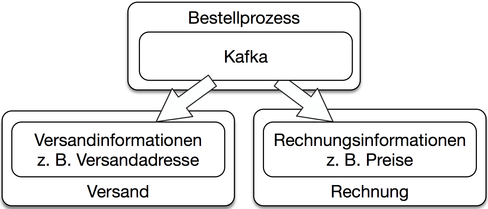

# Konzept: Asynchrone Microservices

Microservices können Nachrichten austauschen. Asynchrone
Kommunikation erlaubt eine lose Kopplung und eine gute Resilience.

## Definition

Asynchrone Microservices grenzen sich von synchronen Microservices
ab. Das nächste Kapitel beschreibt synchrone Microservices
detailliert. Der Begriff "synchrone Microservices" steht für
Folgendes:

> Ein Microservice ist synchron, wenn er bei der Bearbeitung von
> Requests selber einen Request an andere Microservices stellt und auf
> das Ergebnis wartet.

Asynchrone Microservices warten also nicht auf die Antworten anderer
Systeme, wenn sie gerade selber einen Request bearbeiten. Dazu gibt es
zwei Möglichkeiten:

* Der Microservice kommuniziert während der Bearbeitung eines Requests
  gar nicht mit anderen Systemen. Dann wird der Microservice
  typischerweise zu einem anderen Zeitpunkt mit den anderen Systemen
  kommunizieren. Der Microservice kann beispielsweise Daten
  replizieren, die bei der Bearbeitung eines Requests genutzt werden. Beispielsweise können Kundendaten repliziert werden, um dann
  bei der Bearbeitung einer Bestellung auf die lokal vorhandenen
  Kundendaten zuzugreifen.

* Der Microservice schickt einem anderen Microservice einen Request,
  wartet aber nicht auf eine Antwort. Ein Microservice für die
  Abwicklung einer Bestellung kann eine Nachricht an einen anderen
  Microservice schicken, der die Rechnung erstellt. Eine Antwort auf
  diese Nachricht ist nicht notwendig und muss daher auch
  nicht abgewartet werden.

## Warum asynchrone Microservices?

Asynchrone Microservices haben einige Vorteile:

* Beim Ausfall eines Kommunikationspartners wird die Nachricht später
  übertragen, wenn der Kommunikationspartner wieder verfügbar ist. So
  bietet asynchrone Kommunikation *Resilience*, also eine Absicherung
  gegen den Ausfall von Teilen des Systems.

* Die Übertragung und auch die Bearbeitung einer Nachricht kann fast
  immer *garantiert* werden: Die Nachrichten werden langfristig
  gespeichert. Irgendwann werden sie bearbeitet. Dass sie bearbeitet
  werden, kann man beispielsweise absichern, indem die Empfänger die
  Nachricht quittieren (Acknowledge).

* Asynchrone Microservices können *Events* implementieren. Events
  bieten eine fachliche Entkopplung. Ein Event könnte beispielsweise
  "Bestellung eingegangen" sein. Jeder Microservice kann selber
  entscheiden, wie er auf den Event reagiert. Beispielsweise kann ein
  Microservice eine Rechnung erstellen und ein anderer die Lieferung
  anstoßen. Wenn weitere Microservices beispielsweise für ein
  Bonusprogramm hinzukommen, müssen diese nur geeignet auf den
  bereits vorhandenen Event reagieren. So ist das System sehr
  leicht erweiterbar.

## Rezept: Messaging mit Kafka

Kafka ist ein Beispiel für eine Message-oriented Middleware (MOM). Ein
MOM verschickt Nachrichten und stellt sicher, dass die Nachrichten
beim Empfänger ankommen. MOMs sind asynchron. Sie implementieren also
kein Request / Reply wie bei synchronen Kommunikationsprotokollen
sondern verschicken nur Nachrichten.

#### Grundlegende Kafka-Konzepte

[Kafka](https://kafka.apache.org/) unterscheidet sich von anderen MOMs
vor allem dadurch, dass es die Nachrichten, die es überträgt,
dauerhaft speichert, statt sie nach der Übertragung zu verwerfen.

Die wesentlichen Konzepte von Kafka sind:

* Es gibt drei *APIs*: die *Producer API* zum Senden von Daten, die *Consumer API* zum Empfangen von Daten und die
  *Streams API* zum Transformieren der Daten.

* Kafka organisiert Daten in *Records*. Sie enthalten den
transportierten Wert als *Value*. Außerdem haben
*Records* einen Schlüssel (*Key*) und einen Zeitstempel
(*Timestamp*).

* *Topics* fassen Records zusammen. So können Events einer bestimmten Art
in einem Topic verschickt werden.

* Topics sind in *Partitionen* unterteilt. Wenn ein Producer einen neuen
Record erstellt, wird der Record an eine Partition des Topics
angehängt. Die Aufteilung der Records
auf die Partitionen erfolgt anhand des Keys des Records.

* Kafka speichert für jeden Consumer den *Offset* für jede
Partition. Dieser Offset zeigt an, welchen Record in der Partition der
Consumer zuletzt gelesen hat. Wenn ein Consumer einen Record
bearbeitet hat, kann der Consumer einen neuen Offset committen. Für
jeden Consumer muss nur der Offset in jeder Partition gespeichert
werden, was relativ leichtgewichtig ist.

* In einer *Consumer Group* gibt es für jede Partition genau einen
  Consumer. So kann sichergestellt werden, dass ein Record von einem
  Consumer bearbeitet wird: Der Record wird einer Partition zugeteilt,
  die dank der Consumer Group von einem Consumer bearbeitet wird.

* *Log Compaction* ist ein Mechanismus, mit dem alte Records gelöscht
  werden können: Wenn es mehrere Records mit derselben ID gibt, werden
  bei einer Log Compaction alle Records bis auf den letzten gelöscht.

Kafka kann als Cluster betrieben werden, um die Ausfallsicherheit und
die Skalierung zu verbessern.

#### Das Kafka-Beispiel

Das Beispiel findet sich unter
<https://github.com/ewolff/microservice-kafka>.  Unter
<https://github.com/ewolff/microservice-kafka/blob/master/WIE-LAUFEN.md>
steht eine umfangreiche Dokumentation bereit, die Schritt für Schritt
die Installation und das Starten des Beispiels erläutert.

Wenn die Docker Container auf der lokalen Maschine laufen, steht unter
<http://localhost:8080/> eine Web-Oberfläche bereit. Die Oberfläche
wird von einem Apache-httpd-Webserver angezeigt, der als Reverse Proxy
auch HTTP-Anfragen an die Microservices weitergibt.

####  Aufteilung des Beispiels in Microservices

Das System besteht aus einem Microservice `order`, der eine Bestellung
über die Web-Oberfläche entgegennimmt. Die Bestellung schickt der
Bestellprozess dann als Record über Kafka an den Microservice für den
Versand `shipping` und den Microservice für die Erstellung der
Rechnung `invoicing`. Die Bestellung wird als JSON übertragen. So
können der Rechnungs-Microservice und der Lieferungs-Microservice aus
der Datenstruktur jeweils die Daten auslesen, die für den jeweiligen
Microservice relevant sind.

Alle Lieferungs-Microservices und alle Rechnungs-Microservices sind
jeweils in einer Consumer Group organisiert. Das bedeutet, dass die
Records für die Bestellungen auf alle Consumer verteilt werden, aber
jeder Record nur an genau einen Consumer geschickt wird. So kann
sichergestellt werden, dass zu einer Bestellung nur ein
Rechnungs-Microservice eine Rechnung schreibt und nur ein
Lieferungs-Microservice eine Lieferung veranlasst.

Der Lieferungs-Microservice und der Rechnungs-Microservice speichern
die Informationen aus den Records in ihren eigenen
Datenbank-Schemata. Alle Microservices nutzen eine gemeinsame
Postgres-Datenbank.

Jeder Kafka-Record enthält eine Bestellung. Der Key ist ID der
Bestellung mit Zusatz `created`, also beispielsweise `1created`.

#### Avro: Ein alternatives Datenformat

Eine Alternative wäre [Avro](http://avro.apache.org/). Das ist ein
Datenformat, das ein binäres Protokoll anbietet aber auch eine
JSON-basierte Repräsentation. Avro hat ein Schema. Dabei ist es zum
Beispiel mit Vorgabewerten auch möglich, Daten von einer alten Version
des Schemas in eine neue Version des Schemas zu konvertieren. Dadurch
können alte Events selbst dann noch verarbeitet werden, wenn das
Schema sich mittlerweile geändert hat.

## Alternatives Rezept: REST mit Atom

Synchrone Microservices kann man auch mit REST umsetzen. So ist es zum
Beispiel möglich, Bestellungen als
[Atom-Feed](https://validator.w3.org/feed/docs/atom.html)
anzubieten. Atom ist ein Datenformat, das ursprünglich entwickelt
wurde, um Blogs für Leser verfügbar zu machen. So wie für jeden neuen
Blog-Beitrag ein neuer Eintrag in einem Atom-Dokument erzeugt wird,
ist dasselbe auch für jede neue Bestellung möglich. Ein
Client muss dann regelmäßig das Atom-Dokument abholen und neue
Einträge verarbeiten. Das ist nicht besonders effizient. Es kann aber
durch HTTP-Caching optimiert werden. Dann werden nur Daten übertragen,
wenn wirklich neue Einträge vorliegen. Eine Paginierung kann außerdem
dafür sorgen, dass nur die neuesten Einträge übertragen werden und
nicht etwa alle.

Ein Beispiel für eine asynchrone Integration von Microservices mit Atom
findet sich unter
<https://github.com/ewolff/microservice-atom>. <https://github.com/ewolff/microservice-atom/blob/master/WIE-LAUFEN.md>
erläutert im Detail die einzelnen Schritte, um das Beispiel ablaufen
zu lassen.

Atom hat den Vorteil, dass es auf REST und HTTP aufsetzt. Dadurch muss
kein eigenes MOM betrieben werden. Meistens sind schon Erfahrungen mit
HTTP und eine Umgebung mit Webservern vorhanden. So kann der Betrieb
auch bei großen Datenmengen eher sichergestellt werden. 

Leider kann diese Art der Kommunikation aber nicht dafür sorgen, dass
eine Bestellung nur von einer Microservice-Instanz empfangen und
bearbeitet wird. Wenn eine der Microservices-Instanzen im Beispiel
eine neue
Bestellung aus dem Atom-Feed ausliest, dann überprüft sie zunächst in
der Datenbank, ob es schon einen Eintrag für diese Bestellung
gibt, und erzeugt nur dann selber einen Eintrag, wenn das nicht der Fall ist. So
wird für jede Bestellung nur ein Eintrag in der Datenbank erstellt.

Es ist übrigens nicht zwingend, das Atom-Format zu nutzen. Genauso gut
kann man ein eigenes Format verwenden, das die Änderungen als Liste
zur Verfügung stellt und dann Details unter Links zur Verfügung
stellt. Ebenso kann ein anderes Feed-Format wie
[RSS](http://web.resource.org/rss/1.0/spec) oder
[JSON Feed](http://jsonfeed.org/) genutzt werden.

#### Andere MOMs

Natürlich kann außer Kafka auch ein anderes MOM genutzt werden. So
gibt es beispielsweise
[JMS-Implementierungen](https://en.wikipedia.org/wiki/Java_Message_Service#Provider_implementations),
die den Java-Messaging-Service-Standard (
[JMS](https://jcp.org/aboutJava/communityprocess/final/jsr914/index.html))
implementieren, oder
[Implementierungen](https://en.wikipedia.org/wiki/Advanced_Message_Queuing_Protocol#Implementations)
des [AMQP](https://www.amqp.org/) (Advanced Message Queuing Protocol).
Dann müssen die Microservices allerdings damit umgehen, dass alte
Events nach einiger Zeit nicht mehr zur Verfügung stehen.

## Fazit

Asynchrone Microservices bieten Vorteile bei der Resilience aber auch
bei der Entkopplung. Kafka ist eine interessante Alternative für
asynchrone Microservices, weil die Historie der Events auch
langfristig gespeichert wird. Außerdem kann dadurch auch eine
Vielzahl von Clients unterstützt werden, ohne dass es allzu viele
Ressourcen verbraucht.

Ein HTTP/REST basiertes System, das Änderungen als Atom-Feed oder in
einem anderen Datenformat anbietet, hat gegenüber Kafka den Vorteil,
dass es keinen zusätzlichen Server benötigt. Dafür ist es nicht ganz
so einfach, eine Nachricht nur an einen Empfänger zu schicken, weil
dafür das Protokoll keine eigene Unterstützung mitbringt.

## Experimente

* Starte das Kafka-Beispiel. Siehe dazu
<https://github.com/ewolff/microservice-kafka/blob/master/WIE-LAUFEN.md>.

* Es ist möglich, mehrere Instanzen des Shipping- oder
  Invoicing-Microservice zu starten. Dazu kann `docker-compose up -d
  --scale shipping=2` oder `docker-compose up -d --scale
  invoicing=2` dienen. Mit
  `docker logs mskafka_invoicing_2` kann man die Logs betrachten. Dort
  gibt der Microservice dann auch aus, welche Kafka-Partitionen er bearbeitet.
