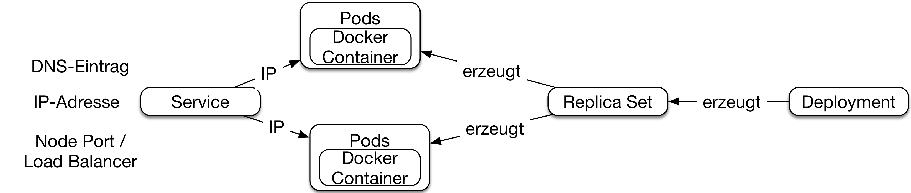

# Synchrone Microservices

Viele Microservice-Systeme setzen synchrone Kommunikation ein. Dieses
Kapitel zeigt, wie synchrone Microservices mit verschiedenen
Technologien umgesetzt werden können.

## Definition

Das letzte Kapitel hat synchrone Microservices bereits definiert:

> Ein Microservice ist synchron, wenn er bei der Bearbeitung von
> Requests selber einen Request an andere Microservices stellt und auf
> das Ergebnis wartet.

Also kann ein synchroner Bestellungs-Microservice von einem anderen
Microservice Kundendaten abholen, während er einen Request für eine
Bestellung bearbeitet.

## Warum synchrone Microservices?

Zu den Gründen für den Einsatz synchroner Microservices zählen:

* Synchrone Microservices sind *einfach zu verstehen*. Statt eines
lokalen Methoden-Aufrufs wird eine Funktionalität in einem
anderen Microservice aufgerufen. Das entspricht dem, was
Programmierer gewohnt sind.

* Es kann eine bessere *Konsistenz* erreicht werden. Wenn bei jedem
  Aufruf die neuesten Informationen aus den anderen Services geholt
  werden, dann sind die Daten aktuell und entsprechen den
  Informationen der anderen Microservices, wenn nicht in letzter
  Sekunde noch eine Änderung eingetreten ist.

Dafür ist *Resilience* aufwändiger: Wenn der aufgerufene
Microservice gerade nicht zur Verfügung steht, muss der Aufrufer 
mit dem Ausfall so umgehen, dass er nicht ebenfalls
ausfällt. Dazu kann der Aufrufer Daten aus einem Cache nutzen oder auf
einen vereinfachten Algorithmus zurückgreifen, der die
Informationen aus dem anderen Microservice nicht benötigt.

## Herausforderungen

Für synchrone Kommunikation müssen einige Herausforderungen gelöst
werden:

* Ein Microservice bietet seine Schnittstelle typischerweise per
TCP/IP unter einer bestimmten IP-Adresse und einem bestimmten Port
an. Der Aufrufer muss diese Informationen bekommen. Dazu dient
*Service Discovery*.

* Von jedem Microservice können mehrere Instanzen laufen. *Load
  Balancing* muss die Aufrufe auf die Instanzen verteilen.

* Nach außen sollen alle Microservices als Teile eines Systems
  wahrgenommen
  werden und unter einer URL bereit stehen. *Routing* sorgt dafür,
  dass Aufrufe an den richtigen Microservice
  weitergeleitet werden.
  
* Wie erwähnt, stellt *Resilience* eine besondere Herausforderung
  dar, mit der ebenfalls umgegangen werden muss.

Eine Technologie für die Umsetzung synchroner Microservices muss für
jede dieser Herausforderungen eine Lösung anbieten.

## Rezept: Kubernetes

[Kubernetes](https://kubernetes.io/) wird als Umgebung für die
Entwicklung und den Betrieb von Microservices immer wichtiger.

#### Docker

Kubernetes basiert auf [Docker](https://www.docker.com/). Docker
erlaubt es, in einem Linux-System Prozesse stärker voneinander zu
entkoppeln: *Docker Container* bieten einem Betriebssystem-Prozess ein
eigenes
Datei-System und ein eigenes Netzwerk-Interface mit einer eigenen
IP-Adresse. Im Gegensatz zu einer virtuellen Maschine nutzen aber alle
Docker Container denselben Linux Kernel. So ist ein Docker Container
kaum aufwändiger als ein Linux-Prozess. Es ist ohne weiteres möglich,
hunderte Docker Container auf einem Laptop laufen zu lassen.

Die Dateisysteme der Docker Container basieren auf *Docker
Images*. Die Images
enthalten alle Dateien, die der Docker Container benötigt. Dazu kann
eine Linux Distribution zählen oder auch eine
Java-Laufzeitumgebung. Docker Images haben Schichten. Die
Linux Distribution kann eine Schicht sein und die
Java-Laufzeitumgebung
eine weitere. Alle Java-Microservices können sich diese beiden
Schichten teilen. Diese Schichten werden dann nur einmal auf dem
Docker Host gespeichert. Das reduziert den Speicherbedarf der Docker
Images erheblich.

#### Kubernetes ist ein Docker Scheduler.

Docker Container auf einem einzigen Docker Host ablaufen zu lassen,
ist nicht ausreichend. Wenn der Docker Host ausfällt, dann
fallen alle Docker Container aus. Außerdem ist die
Skalierbarkeit durch die Leistungsfähigkeit des Docker Hosts
begrenzt.

Um Docker Container in einem Cluster von Rechnern laufen zu lassen,
gibt es Scheduler wie *Kubernetes*. Kubernetes führt dazu einige
Konzepte ein:

* *Nodes* sind die Server, auf denen Kubernetes läuft. Sie sind in
  einem Cluster organisiert.

* *Pods* sind mehrere Docker Container, die zusammen einen Dienst
  erbringen. Das kann beispielsweise ein Container mit einem
  Microservice zusammen mit einer Container für die Log-Verarbeitung
  sein.

* Ein *Replica Set* sorgt dafür, dass immer von jedem Pod eine
bestimmte Anzahl Instanzen läuft.

* Ein *Deployment* erstellt ein Replica Set und stellt dafür die
  benötigten Docker Images zur Verfügung.

* *Services* machen Pods zugreifbar. Die Services sind unter einem
  Namen im DNS zu finden und haben eine feste IP-Adresse, unter der
  sie im gesamten Cluster kontaktiert werden können. Außerdem
  ermöglicht der Service das Routing von Zugriffen von außen.

Die Grafik zeigt die Kubernetes-Konzepte im Überblick: Das Deployment
erzeugt ein Replica Set. Das Replica Set erzeugt nicht nur die
Kubernetes Pods, sondern startet auch neue, falls einige der Pods
ausfallen. Die Pods umfassen einen oder mehrere Docker Container.

Der Kubernetes Service erstellt den DNS-Eintrag und macht den Microservice unter
einer IP-Adresse verfügbar, die im gesamten Cluster eindeutig
ist. Schließlich erstellt der Server einen *Node Port*. Unter diesem
Port kann der Service auf allen Kubernetes-Nodes erreicht werden. Statt
einem Node Port kann ein Service auch einen *Load Balancer*
erstellen. Das ist ein Load Balancer, der von der Infrastruktur
angeboten wird. Wenn Kubernetes in der Amazon Cloud läuft, würde
Kubernetes einen Amazon Elastic Load Balancer erstellen.

#### Synchrone Microservices mit Kubernetes

Die Herausforderungen synchroner Microservices löst Kubernetes
folgendermaßen: 

* Für *Service Discovery* nutzt Kubernetes DNS. Der Kubernetes-Service
  richtet den entsprechenden Eintrag ein. Andere Microservices können
  dann über den Hostnamen zugreifen.

* *Load Balancing* implementiert Kubernetes auf IP-Ebene. Der
  Kubernetes-Service hat eine IP-Adresse. Hinter den
  Kulissen wird der Verkehr zu der IP-Adresse auf eine der
  Service-Instanzen umgeleitet.

* Beim *Routing* kann der Kubernetes-Service entweder über den Node
  Port oder über einen Load Balancer erreicht werden. Das hängt davon ab, wie der
  Service konfiguriert ist und ob die Infrastruktur einen Load
  Balancer anbietet. Ein externer Nutzer kann entweder auf den Load
  Balancer oder auf den Node Port zugreifen und so den Microservice
  nutzen.

* Für *Resilience* hat Kubernetes keine Lösung parat. Natürlich
  kann Kubernetes Pods neu starten, aber weitere Resilience Patterns
  wie Timeout oder Circuit Breaker implementiert Kubernetes
  nicht.

Die Lösung, die Kubernetes für die Herausforderungen
synchroner Microservices bietet, führen zu keinen Code-Abhängigkeiten
zu Kubernetes. Wenn ein Microservice einen anderen
aufruft, muss er den Namen aus dem DNS auslesen und kommuniziert mit
der zurückgegebenen IP-Adresse. Das unterscheidet sich nicht von der
Kommunikation mit einem beliebigen anderen Server. Beim Routing nutzt
ein externes System einen Port auf einem Kubernetes Host oder einen
Load Balancer. Auch in diesem Fall ist transparent, dass hinter den
Kulissen Kubernetes am Werk ist.

#### Das Beispiel mit Kubernetes

Das Beispiel ist unter
<https://github.com/ewolff/microservice-kubernetes>
verfügbar. <https://github.com/ewolff/microservice-kubernetes/blob/master/WIE-LAUFEN.md>
erläutert die Schritte detailliert, um die notwendige
Software zu installieren und das Beispiel laufen zu lassen.

Das Beispiel besteht aus drei Microservices: Order, Customer und
Catalog. Order nutzt Catalog und Customer mit der
REST-Schnittstelle. Außerdem bietet jeder Microservice einige
HTML-Seiten an.

Zusätzlich ist im Beispiel ein Apache-Webserver installiert, der dem
Benutzer mit einer Webseite einen einfachen Einstieg in das System
ermöglicht.

Ebenso steht ein Hystrix Dashboard als eigener Kubernetes Pod zur
Verfügung.  Das
Beispiel nutzt die Java-Library
[Hystrix](https://github.com/Netflix/Hystrix/), um Resilience zu
erreichen. Diese Bibliothek führt Aufrufe in einem anderen Thread Pool
aus und implementiert unter anderem einen Timeout für die Aufrufe.

Auf einem Laptop kann man das Beispiel mit 
[Minikube](https://github.com/kubernetes/minikube) ausführen. Diese
Kubernetes-Distribution ist sehr einfach installierbar. Sie bietet
aber keinen Load Balancer, so dass die Services nur über einen Node
Port bereit stehen.

Das Skript `docker-build.sh` erzeugt die Docker Images für die
Microservices und lädt sie in den öffentlichen Docker Hub
hoch. Dieser Schritt ist optional, da die Images bereits auf dem
Docker Hub liegen.

Das Skript `kubernets-deploy.sh` deployt die Images aus dem
öffentlichen Docker Hub. Dazu nutzt das Skript das Werkzeug
`kubectl`. `kubectl run` dient dazu, das Image zu starten. Das Image
wird von der angegebenen URL im Docker Hub heruntergeladen. Außerdem
wird definiert, welchen Port der Docker Container bereitstellen
soll. `kubectl run` erzeugt das Deployment, welches das Replica Set
und damit die Pods erzeugt. `kubectl expose` erzeugt den Service, der
auf das Replica Set zugreift und so IP-Adresse, Node Port bzw. Load
Balancer und DNS-Eintrag erstellt.

Dieser Ausschnitt aus `kubernetes-deploy.sh`  zeigt die 
Nutzung der Werkzeuge am Beispiel des Catalog-Microservice:

~~~~~~~~
#!/bin/sh
if [ -z "$DOCKER_ACCOUNT" ]; then
  DOCKER_ACCOUNT=ewolff
fi;
...
kubectl run apache \\
 --image=docker.io/$DOCKER_ACCOUNT/microservice-kubernetes-demo-catalog:latest
  \\
 --port=80
kubectl expose deployment/catalog --type="LoadBalancer" --port 80
...
~~~~~~~~

## Alternative Rezepte: Netflix, Consul, Cloud Foundry

Außer Kubernetes gibt es einige weitere Lösungen für synchrone Microservices:

* *Cloud Foundry* nutzt wie Kubernetes auch Docker. Allerdings ist
  Cloud Foundry ein PaaS (Platform as a Service). Es bietet
  Anwendungen eine vollständige Plattform. Daher ist es nicht
  notwendig, selber Docker Container zu erstellen. Es reicht aus, eine
  Java-Anwendung anzubieten.
  - *Service Discovery* setzt Cloud Foundry ebenfalls mit DNS um.
  - Die Plattform implementiert *Load Balancing* auf Netzwerk-Ebene.
  - Für das *Routing*  von Zugriffen von außen reicht ebenfalls
    der DNS-Name des Microservice.
  - *Resilience* unterstützt Cloud Foundry nicht direkt.

    Die
    [Cloud-Foundry-Demo](https://github.com/ewolff/microservice-cloudfoundry)
    implementiert ein Beispiel, das im wesentlichen mit dem
    Kubernetes-Beispiel identisch ist. Es gibt eine ausführliche
    [deutsche Anleitung zum Starten des Beispiels](https://github.com/ewolff/microservice-cloudfoundry/blob/master/WIE-LAUFEN.md).

* *Consul* ist eigentlich eine Service-Discovery-Technologie. Sie
  lässt sich allerdings mit einigen anderen Technologien zu einer
  vollständigen Lösung für Microservices ausbauen.
  - Für *Service Discovery* bietet Consul ebenfalls eine
    DNS-Schnittstelle, aber auch eine eigene Schnittstelle, mit der
    Service-Discovery-Informationen eingetragen und ausgelesen werden
    können. 
  - Für das *Routing* bietet Consul selber keine Lösung. Aber
    [Consul Template](https://github.com/hashicorp/consul-template)
    kann mit einem Template eine Konfigurationsdatei für einen
    beliebigen Service mit Informationen über die Microservices
    ergänzen. So kann beispielsweise ein Webserver so konfiguriert
    werden, dass er die HTTP-Zugriffe von außen an die Microservices
    verteilt. Der Webserver liest lediglich die Konfigurationsdatei
    aus und muss keinerlei Schnittstelle zu Consul implementieren.
  - *Load Balancing* kann genauso wie Routing mit einem Webserver und
    Consul Template implementiert werden. Eine Alternative ist eine
    Java-Bibliothek wie
    [Ribbon](https://github.com/Netflix/ribbon/wiki), die das Load
    Balancing im aufrufenden Microservice implementiert.
  - *Resilience* muss mit einer zusätzlichen Bibliothek implementiert
    werden.

    Das
    [Consul-Beispiel](https://github.com/ewolff/microservice-consul/)
    nutzt Spring Cloud, um die Microservices bei Consul zu
    registrieren und Ribbon für das Load Balancing. Resilience deckt
    Hystrix ab. Ein Apache httpd setzt das Routing um. Consul Template
    konfiguriert den Apache httpd. Eine Alternative wäre
    [Registrator](https://github.com/gliderlabs/registrator), das
    Docker Container in Consul registrieren kann. Zusammen mit einem
    Zugriff auf Consul über DNS könnte Consul genauso transparent
    genutzt werden wie Kubernetes oder Cloud Foudnry.

* Der *Netflix Stack* stellt eine vollständige Lösung für synchrone
  Microservices dar.
  - Für *Service Discovery* steht Eureka bereit. Es bietet ein
    REST-Interface und ermöglicht auch einen Cache auf dem Client
    beispielsweise mit der Eureka-Java-Client-Bibliothek.
  - *Load Balancing* setzt der Netflix-Stack mit Ribbon um. Das ist
    eine Java-Bibliothek, die aus den von Eureka übermittelten Service
    Instanzen eine auswählt.
  - Für das *Routing* steht Zuul bereit, ein in Java geschriebener
    Proxy. Zuul kann mit eigenen Filtern ergänzt werden, die in Java
    oder Groovy geschrieben sein können. Dadurch kann Zuul sehr
    flexibel erweitert werden.
	- *Resilience* setzt der Netflix-Stack mit Hystrix um.

    Das [Netflix-Beispiel](https://github.com/ewolff/microservice)
    nutzt Spring Cloud, um den Netflix-Stack in die Java-Anwendungen
    zu integrieren. Das Microservices-System implementiert dasselbe
    Szenario wie die anderen Beispiele für synchrone Microservices. 

Die Beispiele Kubernetes und Cloud Foundry haben keine
Code-Abhängigkeiten. So eine Lösung ist mit Consul ebenfalls
implementierbar. Dadurch können in den Microservice-Systemen auch
andere Technologien als Java genutzt werden. Das unterstützt die
Technologie-Freiheit.

## Fazit

Kubernetes bietet eine sehr mächtige Lösung für die Implementierung
von synchronen Microservices, die außerdem den Betrieb
der Microservices abdeckt. PaaS
wie Cloud Foundry bieten eine höhere Abstraktion,
so dass der Nutzer sich nicht mit Docker auseinandersetzen muss. Aber
sowohl Kubernetes als auch Cloud Foundry erzwingen eine andere
Ablaufumgebung. Das ist bei Consul und Netflix nicht so: Beide Systeme
können in Docker Containern wie auch auf virtuellen Maschinen oder
physischen Servern betrieben werden. Consul bietet dabei wesentlich
mehr Features.

## Experimente

* Starte das Beispiel wie unter 
 <https://github.com/ewolff/microservice-kubernetes/blob/master/WIE-LAUFEN.md>
 beschrieben.
  * Öffne den Apache httpd mit `minikube service apache`.
  * Öffne das Kubernetes Dashboard mit `minikube dashboard`.

* Teste das Load Balancing im Beispiel:
  * `kubectl scale` ändert die Anzahl der Pods in einem Replica Set.
  `kubectl scale -h` zeigt an, welche Optionen es
  gibt. Skaliere beispielsweise das Replica Set `catalog`.
  * `kubectl get deployments` zeigt an, wie viele Pods im jeweiligen
    Deployment laufen.
